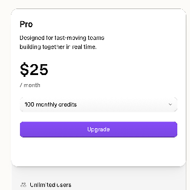
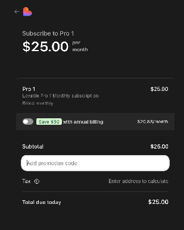
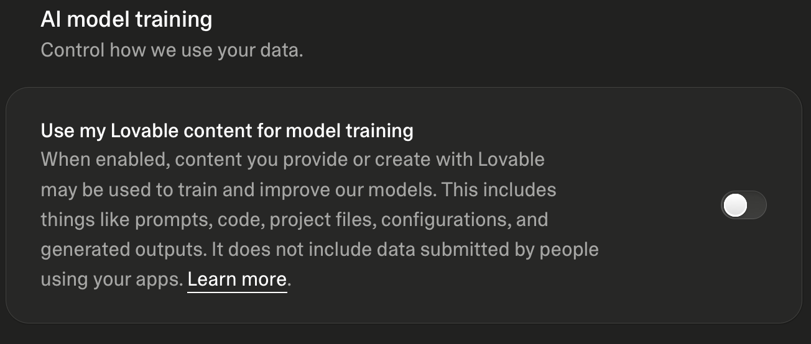
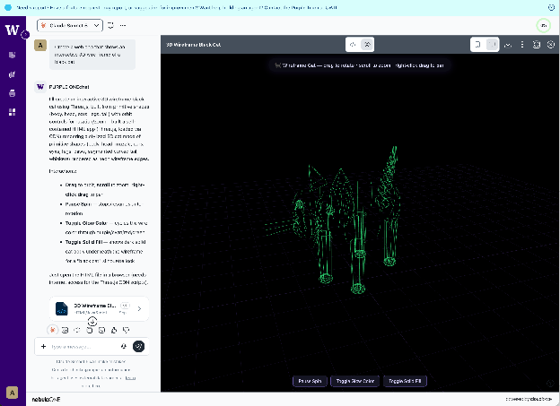

# Project 1: Setup

You will need to set up Lovable or Purple UW for this project. Choose one below:

## Lovable

**Set up Lovable**

1.  Get your Lovable pro plan code from the course staff.
2.  Create an account on <https://lovable.dev/>
3.  Go to <https://lovable.dev/pricing> and select Pro, 100 monthly credits. You will need to provide credit card information, but will not get charged.
4.  In the purchase screen, paste your course code under Add promotion code.
5.  Settings/{Your account}/AI Model Training/Use my Lovable content for model training (turn it off)

------------------------------------------------------------------------

## Purple UW

Use Purple

1.  Open <https://purple.uw.edu/> and sign in using your UW credentials.
2.  On the top left, you can select the model you want to use. For this assignment, any model is fine; just say which one you used.
3.  Because Purple is not optimized for web app development, you should specify what you’re building. Start your prompt with ‘Create a mobile web app…’.
4.  Purple then opens an interactive code viewer. From there, switch to mobile view by clicking the phone icon. When you are finished, download the file by clicking the download button.
5.  You can track your context window through the percentage on the top right corner.

